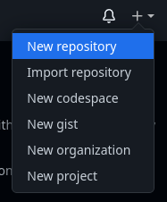
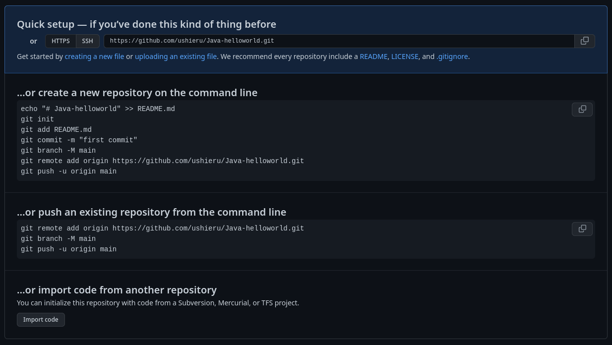

<h1>  GIT</h1>

Git es un sistema de control de versiones diseñado para manejar cualquier tipo de proyecto en cualquier tipo de lenguaje. Permite a los desarrolladores colaborar en proyectos, hacer un seguimiento de los cambios realizados en el código y revertir a versiones anteriores si es necesario.

## Instalacion

Instalaremos esta herramienta desde su **[pagina oficial](https://git-scm.com/)**.

Como saber si esta correctamente instalado? Abre tu terminal favorita y corre el siguiente comando:
> Lo que ves despues del signo **#** es un ejemplo de respuesta que muestra la terminal.
```sh
git --version
# git version x.x.x
```

## Configuracion

Para empesar a utilizar Git, primero tenemos que configurarlo con un par de comandos para que tenga conocimiento de quienes somos. Asi que abre tu terminal favorita y empecemos.

- Username
```sh 
    git config --global user.email "correo@domain.com"
```
- Email
```sh 
    git config --global user.name "nombre o nombre de usuario"
```
- Rama por default
```sh
    git config --global init.defaultBranch main
```

## Comandos básicos de Git:

- **git init**: Este comando se utiliza para crear un nuevo repositorio de Git.
- **git add**: Este comando se utiliza para agregar archivos a un repositorio de Git.
- **git commit**: Este comando se utiliza para confirmar los cambios realizados en el código.

## Ejercicio practico

Empezemos por crear la carpeta de nuestro proyecto en este caso yo la llamare `hello-world` y un archivo `Main.java`.

```java
public class Main {
    public static void main(String[] args){
        System.out.println("Hello world");
    }
}
```
Ahora inicializamos nuestro repositorio de git.

```sh
    git init
    # Inicializado repositorio Git vacío en /code house/git/.git/
```

Ahora agregaremos nuestro archivo `Main.java` al repositorio.

```sh
    git add Main.java
```

Confirmamos que agregamos nuestro archivo con un mensaje.

```sh
    git commit -m "hello world en Java"
    # [main (commit-raíz) 4090ac3] hello world en java
    # 1 file changed, 5 insertions(+)
    # create mode 100644 Main.java
```

Ahora hagamos un pequeño cambio a nuestro archivo. En ves de `Hello World` sera `Hello Git`.

```java
public class Main {
    public static void main(String[] args){
        System.out.println("Hello Git");
    }
}
```

Como nuestro codigo ahora tiene una modificacion, tenemos que agregar esta nueva version de nuestro codigo al repositorio. Repetimos con `git add` y `git commit`.

```sh
    git add Main.java

    git commit -m "hello git en Java"
    # [main 82bce53] hello git en java
    # 1 file changed, 1 insertion(+), 1 deletion(-)
```

Bueno... pero quedamos que esto es para versionar codigo. ¿Que pasa si ahora quiero volver al mensaje **Hello World**?

Con `git log` puedo ver el historial de cambios registrados a partir de los commits. Y es por eso que se les agrega un mensaje `-m "hello git en Java"` para que nosotros los podamos diferenciar a partir de esos mensajes.

Ejecutemos entonces:

```sh
    git log

    # commit 82bce53f81a779bae7828dff53e4dadc87f1bcf9 (HEAD -> main)
    # Author: ushieru <uzielcocolan@gmail.com>
    # Date:   Tue Mar 21 18:48:15 2023 -0600

    #     hello git en java

    # commit 4090ac303ade3638d8ca16e75f57ef6a6925f1ed
    # Author: ushieru <uzielcocolan@gmail.com>
    # Date:   Tue Mar 21 18:38:10 2023 -0600

    #     hello world en java
```

Como podemos observar cama commit esta diferenciado por un HASH unico e irrepetible que nos costaria mucho recordar y diferenciar de otras versiones pero estos vienen acompañados del mensaje que dejamos. Enconces sabemos que el commit **4090ac303ade3638d8ca16e75f57ef6a6925f1ed** es el mensaje de "Hello World". Para volver a esa version del codigo solo tenemos que hacer un `git checkout <commit>`.

Intentemoslo:
> ESte comando te lo dejo como ejemplo pero solo funciona para mi, tu debes usar el HASH que te genero a ti para este commit.
> git checkout 4090ac303ade3638d8ca16e75f57ef6a6925f1ed
```sh
    git checkout <commit>
    # La posición previa de HEAD era 82bce53 hello git en java
    # HEAD está ahora en 4090ac3 hello world en java
```

Como podras comprobar tu archivo ahora tiene el siguiente contenido:
```java
public class Main {
    public static void main(String[] args){
        System.out.println("Hello world");
    }
}
```
Volvimos a una version anterior del codigo. Ahora si queremos volver a la ultima version repetimos `git checkout <commit>` apuntando al hash del commit mas reciente.
> En mi caso seria 82bce53f81a779bae7828dff53e4dadc87f1bcf9.

Y listo. Terminaste tu introduccion a Git.

## Github
No confundir Git con Github. Git es a Github lo que los videos a youtube. Git nos ayuda a versionar un repositorio, GitHub es un servicio web que aloja proyectos de software basados en Git. GitHub proporciona una plataforma en línea para que los desarrolladores carguen su código fuente, realicen un seguimiento de los cambios y colaboren con otros desarrolladores en el mismo proyecto. Además, también ofrece herramientas para la revisión de código, la gestión de problemas y la integración continua.

### Crea una cuenta
Para continuar cree una cuenta en [Github](https://github.com/).

Una ves creo su cuenta inicie sesion y cree un nuevo repositorio. En la esquina superior derecha vera un signo de **+**.



Creemos un repositorio de nombre `java-helloworld`, puedes colocar la descripcion que tu quieras pero para este ejemplo el repositorio debe ser publico. Una ves lo creemos veremos una pantalla como esta:



Los primeros pasos son para crear un repositorio nuevo, nosotros ya creamos el nuestro asi que segiremos los pasos de `...or push an existing repository from the command line`. Asi que en nuestra terminal debemos estar en la carpeta de nuestro proyecto y correr los siguientes comandos:

> Esto te pedira iniciar sesion en tu cuenta de Github y despues empujara tu codigo a Github.

```sh
# Este comando agrega la relacion del repositorio de Github con nuestro repositorio local.
git remote add origin https://github.com/ushieru/Java-helloworld.git
# Este comando le da nombre a la rama en la que vamos a trabajar
git branch -M main
# Este comando empuja los cambios a Github
git push -u origin main
# Enumerando objetos: 6, listo.
# Contando objetos: 100% (6/6), listo.
# Compresión delta usando hasta 8 hilos
# Comprimiendo objetos: 100% (4/4), listo.
# Escribiendo objetos: 100% (6/6), 545 bytes | 545.00 KiB/s, listo.
# Total 6 (delta 1), reusados 0 (delta 0), pack-reusados 0
# remote: Resolving deltas: 100% (1/1), done.
# cTo https://github.com/<username>/Java-helloworld.git
#  * [new branch]      main -> main
# rama 'main' configurada para rastrear 'origin/main'.
```

Listo, ya tienes tu repositorio en Github, ya puedes empezar a tener control de tu codigo y colaborar con otros desarrolladores.

## Glosario

- **Repositorio**: Un repositorio de Git es un lugar donde se almacena el código fuente de un proyecto. Los repositorios pueden ser locales (en la computadora del desarrollador) o remotos (en un servidor). Un repositorio de Git contiene todas las versiones del código fuente de un proyecto, así como la información sobre quién hizo los cambios y cuándo se hicieron.

- **Commit**: Un commit en Git es una confirmación de cambios en el código fuente. Cada commit se identifica por un número de hash único que se usa para hacer referencia a él. Un commit generalmente incluye un mensaje descriptivo que explica los cambios realizados.

- **Branch**: Una rama (branch en inglés) en Git es una línea de desarrollo separada que se crea a partir de la rama principal (llamada "master" por convención). Las ramas se utilizan para trabajar en nuevas características o correcciones de errores sin afectar el código principal. Cuando se completa una nueva característica o corrección de errores, se puede fusionar la rama de desarrollo con la rama principal.

- **Merge**: La fusión (merge en inglés) en Git se utiliza para combinar los cambios realizados en diferentes ramas de desarrollo. Por ejemplo, si un desarrollador trabaja en una nueva característica en una rama separada y otro desarrollador corrige un error en la rama principal, la fusión se utiliza para combinar estos cambios en una sola rama.

- **Remote**: Un repositorio remoto es un repositorio de Git que se encuentra en un servidor en línea (como GitHub o Bitbucket). Los desarrolladores pueden enviar sus cambios a un repositorio remoto para colaborar con otros desarrolladores en el mismo proyecto.

- **Pull**: Un pull en Git es una operación que se utiliza para descargar los cambios realizados en un repositorio remoto. Los desarrolladores pueden usar el comando "git pull" para actualizar su repositorio local con los últimos cambios del repositorio remoto.

- **Push**: Un push en Git es una operación que se utiliza para enviar los cambios realizados en un repositorio local a un repositorio remoto. Los desarrolladores pueden usar el comando "git push" para enviar sus cambios al servidor remoto y colaborar con otros desarrolladores en el mismo proyecto.